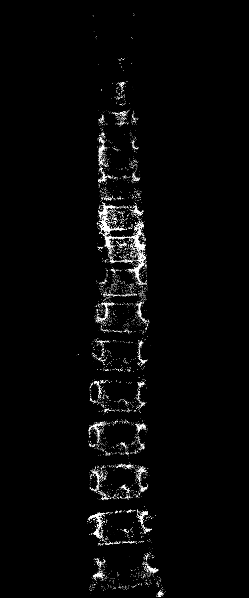

### GUI -

### Standard Image Processing

### Extract the Spine feature

### Generate the pre-train dataset
Global Histogram -> mean filter by 3 times -> Sobel (Combined) -> Mask -> Detection -> Smooth -> Shift Spine -> Exctra -> Bypass -> Local Histogram -> Local Band Pass

